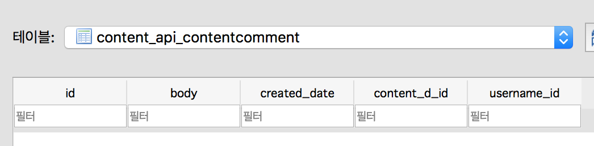

## 04/14

### Django REST framework Tutorial 재진행


#### Router

class based view 에서 URL을 자동으로 정리해 준다.

ViewSet 만 적용된다.

APIView 는 안된다.

## 04/15

#### permission

게시물에 대해 댓글 기능 구현중..

댓글은 작성자만 편집할 수 있고 보기는 누구나 가능해야 한다.

게시물을 출력시 댓글도 같이 불러와야한다..

일단 권한은 아래처럼 permissions.py 으로 custom permission 을 적용해 주면 된다.

권한을 이용해 게시물에도 똑같이 적용할 수 있다. (지금 구현하는건 공공데이터를 통해 자동저장하므로 작성자가 없어서 관리자 외에는 수정권한이 없게 하였다.)

```
# permissions.py

from rest_framework import permissions

class IsOwnerOrReadOnly(permissions.BasePermission):
    def has_object_permission(self, request, view, obj):
        if request.method in permissions.SAFE_METHODS:
            return True
        return obj.owner == request.user
```

```
#views..py

class SnippetViewSet(viewsets.ModelViewSet):
    queryset = PostComment.objects.all()
    serializer_class = SnippetSerializer
    permission_classes = (permissions.IsAuthenticatedOrReadOnly, IsOwnerOrReadOnly,)
    # IsAuthenticatedOrReadOnly : 익명의 사
    pagination_class = CommentPagination

    def perform_create(self, serializer):
        serializer.save(author=self.request.user)
```

```
# serializers.py

class SnippetSerializer(serializers.HyperlinkedModelSerializer):
    author = serializers.ReadOnlyField(source='author.username')

    class Meta:
        model = PostComment
        fields = '__all__'
        
```

```
#models.py

from django.db import models

class PostComment(models.Model):
    body = models.TextField()
    score = models.CharField(max_length=1, null=True)
    created_date = models.DateTimeField(auto_now_add=True)
    post = models.ForeignKey(Content, on_delete=models.CASCADE)
    author = models.ForeignKey(MyUser, related_name='post_author')

    class Meta:
        ordering = ('created_date',)
```

## 04/16

계획을 변경하여 content view api에서 content의 comment를 바로 출력하기로 함.

serializer를 통하여 구현하려고 한다.


```python
          from rest_framework import serializers

from content_api.models import Content
from content_api.models.content import PostComment

__all__ = (
    'ContentDetailSerializer',
    'ContentSimpleSerializer',
)


# 전체 콘텐츠 출력시 기본정보만 나오는 시리얼라이저
class ContentSimpleSerializer(serializers.ModelSerializer):
    class Meta:
        model = Content
        fields = ('seq', 'title', 'start_date', 'end_date', 'place', 'realm_name',
                  'area', 'price', 'thumbnail',)


# 상세페이지에서 추가 정보 불러오기 위한 필드(작업중)
class CommentListField(serializers.RelatedField):
    def to_representation(self, value):
        return 'review %s' % (value.username,)


# 상세 페이지 출력시 상세정보까지 나오는 시리얼라이저
class ContentDetailSerializer(serializers.ModelSerializer):
    comment = CommentListField(many=True, read_only=True)

    class Meta:
        model = Content
        fields = '__all__' 

# 코멘트 시리얼라이저
class CommentSerializer(serializers.ModelSerializer):
    class Meta:
        model = PostComment
        fields = '__all__'
```

하지만 model의 relation 때문에 막힌다...
시리얼라이저로 content에서 comment를 출력하려하지만 
MyUser의 필드가 없기 때문에 안됨...

comment 모델을 지정하였지만 동작하지 않는다...

[참고문서 REST](https://github.com/KimDoKy/DjangoRestFramework-Tutorial/blob/master/doc/Django%20REST%20Framework%20-%2011.%20Serializer%20relations.md)

> 구현하려던 serializer(두개 이상의 모델을 중첩으로 보여주는 serializer)는 APIView에서는 구현이 가능하지만 ViewSet에서는 동작하지 않는다.

## 04/17

ManyToManyField 로 모델간의 관계를 형성하고 migrations를 하면

ManyToManyField를 선언한 쪽에서는 해당 필드가 테이블에 생성되지 않는다.
(ManyToManyField와 같은 related 필드는 SQL문에서 CREATE가 아닌 것으로 추측된다.)

해당 정보 및 추가 내용은 중간자모델이 생성되거나 정의한 중간자모델에 필드로 생성된다.

```python

from django.contrib.auth import get_user_model
from django.db import models

__all__ = (
    'Content',
)

# User모델 가져오기
User = get_user_model()


class Content(models.Model):
    seq = models.CharField(max_length=20, unique=True)
    title = models.CharField(max_length=100, null=True)
    start_date = models.DateField(null=True)
    end_date = models.DateField(null=True)
    place = models.TextField(null=True)
    realm_name = models.TextField(null=True)
    area = models.TextField(null=True)
    price = models.TextField(null=True)
    content = models.TextField(null=True)
    ticket_url = models.TextField(null=True)
    phone = models.TextField(null=True)
    thumbnail = models.TextField(null=True)
    gps_x = models.TextField(null=True)
    gps_y = models.TextField(null=True)
    place_url = models.TextField(null=True)
    place_addr = models.TextField(null=True)
    place_seq = models.TextField(null=True)

    # 중간자 모델인 Bookmark를 이용해 User와 연결
    bookmarks = models.ManyToManyField(User, through='Bookmark')

    # DRF에서 구체적인 공연명을 알기 위한 설정
    def __str__(self):
        return self.title

    # Comment는 추후에 구현
    comment_user = models.ManyToManyField(
        User,
        through='ContentComment',
        related_name='comment_relate',
    )


class ContentComment(models.Model):
    content_d = models.ForeignKey(Content, on_delete=models.CASCADE)
    username = models.ForeignKey(User, on_delete=models.CASCADE)
    body = models.TextField()
    created_date = models.DateTimeField(auto_now_add=True)

```

위의 코드들에서는 User, Content, ContentComment 3개의 클래스가 관계를 형성하고 있다.

Content에서 MTM을 comment_uset(ContentComment가 뒤에 정의되고 ContentComment에서도 Content를 부르고 있기 때문에 서로 선언하면 선언 시점이 서로 어긋나서 오류가 발생한다. 그렇기 때문에 다른 앱의 모델(User)을 선언하였다.)으로 선언하였다.  
> 아직 정의되지 않은 모델에서 관계를 작성해야하는 경우, 모델 오브젝트 자체가 아닌 모델 이름을 사용할 수 있습니다.

```
from django.db import models

class Car(models.Model):
    manufacturer = models.ForeignKey(
        'Manufacturer',
        on_delete=models.CASCADE,
    )
    # ...

class Manufacturer(models.Model):
    # ...
    pass
```
>[장고 문서](https://docs.djangoproject.com/en/1.11/ref/models/fields/#model-field-types)
(이 부분을 문서에서 늦게 봐서, 모델을 되돌려서 테스트하기엔 늦은것 같아 그대로 사용하였다.)

 ContentComment를 ForeignKey으로 Content와 User를 각각 연결하고 body라는 필드로 TextField를 선언하여 추가정보를 저장하는 중간자 모델로 구현하였다.



ForeignKey로 선언된 필드는 중간자 모델에서 필드명_id 으로 생성되며 관계된 모델의 id 값을 저장한다.

MTM을 사용하면 중간자 모델은 직접 생성하지 않아도 기본적으로 생성이 된다.

models.py 작성시 SQL문이 어떻게 실행되는지 더 공부해야 할 필요가 있다. ([Django Model Document](https://docs.djangoproject.com/en/1.11/topics/db/models/))

## 04/18

현재 진행하는 프로젝트에서는 데이터는 공공데이터 api를 통하여 정보를 제공해주고 있다. 공공 데이터는 xml으로 데이터를 넘겨주기 때문에 JSON으로 파싱하여 for을 이용해서 DB에 저장한다.
그리고 DB에 있는 데이터를 프론트단의 요청에 따라 분류하여 serializer하려 데이터를 보내주는 api이다.

하지만 파라미터값을 잘못 입력하면 'Server Error 500'이 발생한다.
유저가 사용하는 것은 아니라서 큰 문제는 없지만 협업하는 입장에서는 오류가 발생하면 일의 속도가 느려지게 된다.

```python
# xml을 parser 후 db 저장
def xml_parser_db_save(request):
    request.get_method = lambda: 'GET'
    response_body = urlopen(request).read()
    data = xmltodict.parse(response_body)

    try:

        item_path = data['response']['msgBody']['perforList']

        for index, item in enumerate(item_path):
            item_path_index = item_path[index]
            seq = item_path_index['seq']
            title = item_path_index['title']
            place = item_path_index['place']
            start_date = item_path_index['startDate']
            start_date_parse = dateutil.parser.parse(start_date).date()
            end_date = item_path_index['endDate']
            end_date_parse = dateutil.parser.parse(end_date).date()
            realm_name = item_path_index['realmName']
            area = item_path_index['area']
            thumbnail = item_path_index['thumbnail']
            gps_x = item_path_index['gpsX']
            gps_y = item_path_index['gpsY']

            Content.objects.get_or_create(
                seq=seq,
                title=title,
                place=place,
                start_date=start_date_parse,
                end_date=end_date_parse,
                realm_name=realm_name,
                area=area,
                thumbnail=thumbnail,
                gps_x=gps_x,
                gps_y=gps_y,
            )
            detail_get(seq)
        return data
    except KeyError:
        error_message = "유효하지 않은 파라미터 혹은 파라미터 값입니다"
        return error_message
```

위 코드는 공공 데이터에서 받아온 xml 데이터를 JSON으로 파싱하여 DB에 저장하는 코드이다.

공공데이터에서 파라미터 값이 잘못되면 오류가 일어나는게 아니라  데이터가 빈 값으로 들어오기 때문에 예외처리를 DB를 저장하는 부분에 선언하였다.
except에 error_message를 바로 리턴해주게 하였기 때문에 서버단에서도 협업하는 사람들도 오류가 왜 일어났는지 바로 알 수 있게되었다.

## 04/19

REST search parameter 를 커스텀 해달라는 요청이 들어왔다.

REST search는 `filters.SearchFilter`를 명시해줌으로써 사용이 가능하지만, 기본적으로 검색 파라미터의 이름은 `search`이지만 `SEARCH_PARAM` 설정으로 재정의 될 수 있다. 자세한 내용은 [장고 문서](https://docs.djangoproject.com/en/1.11/ref/contrib/admin/#django.contrib.admin.ModelAdmin.search_fields)를 참조해야한다. (하지만 그닥 도움은 안되는 것 같다. 내가 못찾는건가..)

저 파라미터 설정은 (가상환경설정시) 'pyenv/versions/가상환경/lib/python3.5/site-packages/rest_framework/setting' 의 DEFAULTS - Filtering 에 명시되어 있다.

```python
# Filtering
    'SEARCH_PARAM': 'search',
    'ORDERING_PARAM': 'ordering',
```

이 값을 변경하면 원하는 파라미터명을 사용할 수 있다.

하지만 문제점이 있다. Git에는 가상환경에 설정한 부분이 포함되지 않는다. 협업에 적용이 되지 않는다.
배포 담당자가 서버에 직접 접속하여 rest_frame에 들어가서 설정값을 변경해주면 가능할 것 같지만, 위험하고 비효율적인것 같다. 다른 방법을 찾아야 한다. 

## 04/20

```python
REST_FRAMEWORK = {
    'DEFAULT_AUTHENTICATION_CLASSES': (
        'rest_framework.authentication.SessionAuthentication',
    ),
    'SEARCH_PARAM': 'q',
}
```

파라미터명 변경건은 셋팅에 전역으로 선언해주면 해결된다.


```
class CustomFilter(SearchFilter):
    parameter_name = 'q'
```
커스텀으로 따로 처리하려고 만들었지만 정확히 어떤걸 오버라이드 해야하는지 모르겠다.

일단 전역으로 선언하여 해결하였다.

---

Comment 개선사항

1. 로그인 구분(토큰?)  
분업으로 인해서 담당 업무자에게 물어봐야함.

2. 추가, 수정, 삭제 조건


## 04/22 ~
TDD 실습 시작

TDD 내용은 [이곳](https://github.com/KimDoKy/study/blob/master/TDD/TDD(Test-Driven%20Development).md)에 추가 된다.

## 04/23
MarkDown에서 편집시 내용중 `<title>` 이 있다면 꼭 `을 넣어주도록 하자. html tag가 적용되어 markdown 입력에 문제가 생긴다.

## 04/24
TDD 6장 하는중... 교재에 있는 에러가 발생하지 않는다......
>
"이것은 Django 테스트 클라이언트가 뷰 함수에서 약간 다른 방식으로 동작하기 때문이다. 즉 도메인을 상대 URL에 추가하는 Django 스택을 사용하고 있기 때문이다. 2 단계 리디렉션 확인 방법 대신에 Django가 제공하는 헬퍼 함수를 사용하도록 한다."

```python
        self.assertEqual(response.status_code, 302)
        self.assertEqual(response['location'], '/lists/the-only-list-in-the-world/')
        
        -> 변경
        
         self.assertRedirects(response, '/lists/the-only-list-in-the-world/')
```
일단 요구하는 결과는 같다...일단 스킵.
[테스트 클라이언트](https://docs.djangoproject.com/en/1.11/topics/testing/tools/)를 더 공부해보자.

추가. 마이그레이션 다루는 법을 더 익혀야함. (ex. fake)

#### 궁금증!
```
self.assertRedirects(response, '/lists/%d' % (correct_list.id,))
```
마지막에 ','(콤마)를 안찎어도 정상 작동하는데 꼭 ','를 찎어야 하는 이유는??  

### 기억하자!!!
**TypeError: add_item() takes 1 positional argument but 2 were given**  
이번 프로젝트를 진행하면서 가장 많이 본 오류일것이다.  
말 그대로 view 인수의 갯수가 안맞다는 것이다.

```python
def add_item(request):
    pass
->
def add_item(request, list_id):
    pass
```
이렇게 인수를 맞추어 주면 된다.

## 04/25

FastCampus 모의면접 준비. Tip.

1. 프로젝트 기능적으로 간단히 설명
2. 사용자/관리자 입장에서의 프로젝트 전체 동작 설명
3. 프로젝트의 백엔드에서 구현한 전체 기능 목차
4. 전체 기능의 각 동작원리(간단하게), 외부 프레임워크/라이브러리 정보
5. 그 중 자신이 개발한 기능에 대한 상세설명
6. 어려웠던 부분 (실제 느낌상 어려웠다가 아니라 기술적으로 난이도가 있고 삽질을 많이해서 이렇게 저렇게 많은 시도를 해봤다 라고 할 수 있는 주제에 대한 상세한 설명 준비)

1,2번은 합쳐서 1분내로 끝나야합니다 (+실제 동작이랑 같이 보여주시는게 더 좋습니다)

> 추가 내용
> 프로젝트 전체 동작에 대해 빠르게 보여줄 수 있는 인덱스 페이지 구현
하이어링데이 인터뷰시 개인노트북에서 만든기능들 바로바로 보여줄 수 있도록 미리 모든링크 가진 인덱스페이지와 동작에 대한 설명파일(텍스트)과 함께 진행
또는 기능별 스크린샷을 미리 준비후 보여줄것
>
다른사람이 만든 기능도 동작원리, 코드위치, 실제 실행위치 전부 알고있을 것
어려웠던부분 -> 실제 느낌상 어려웠다가 아니라 기술적으로 난이도가 있고 삽질을 많이해서 이렇게 저렇게 많은 시도를 해봤다 라고 할 수 있는 주제에 대한 상세한 설명 준비
테스트코드 만들었으면 어떤부분에 대해 어떤 테스트 목록을 만들었는지 작성
라이브러리나 프레임워크를 선택한 기준이 무엇인지, 그리고 프레임워크가 해주는 기능이 어떤 역할인지
AWS에서 배포를 위해 EC2, ECS, EB등 여러가지가 있는데 EC2직접배포와 비교했을 때 EB와 Docker의 장점에 대해 정리

>
하이어링데이전 이부분은 반드시 미리 준비해가세요. 목차 보여주면서 설명하시면 되기때문에 와우지 않으셔도됩니더

>
추가로 코드 자동 리포매팅 안한부분있으면 전부 적용하세요

하이어링데이 전까지 잠시 TDD 스터디를 멈추고

OAuth 인증 (소셜로그인)과 배포(AWS,EC2,Docker..)으로 스터디 방향을 바꿈.

**MaxOS Sierra ` 입력 이슈 tip**

```
cd ~/Library
mkdir KeyBindings
cd KeyBindings
vi DefaultkeyBinding.dict

  1 {
  2         "₩" = ("insertText:", "`");
  3 }
```
## 04/26
25~26일에 거쳐 [프로젝트 API](https://kimdoky.gitbooks.io/pm0603-project-api-document/) 문서를 재정리 하였음.  


### [OAuth](http://d2.naver.com/helloworld/24942)

최근 인터넷 서비스들은 서비스 중에서 사용자가 일부 필요한 것만 사용할 수 있게 하는 SaaS(Softwarer as a Service)의 형태로 서비스된다.(Facebook, 트위터  등)
외부 서비스와 연동되는 facebook이나 트위터의 기능을 이용하기 위해 사용자가 facebook이나 트위터에 로그인하는 것이 아니라, 별도의 인증 절차를 거치면 다른 서비스에서 Facebook과 트위터의 기능을 이용할 수 있게 되는것이다.  
이 방식에서 사용하는 인증 절차가 OAuth이다.

용어 | 설명
---|---
User|Service Provider에 계정을 가지고 있으면서, Consumer를 이용하려는 사용자
Service Provider|OAuth를 사용하는 Open API를 제공하는 서비스
Consumer|OAuth 인증을 사용해  Service Provider의 기능을 사용하려는 애플리케이션이나 웹 서비스
Request Token|Consumer가 Service Provider에세 권한을 인증받기 위해 사용하는 값. 인증이 완료된 후에는 Acceses Token으로 교환한다.
Access Token|인증 후 Consumer가 Service Provider의 자원에 접근하기 위한 키를 포함한 값


#### 회사 방문 과정의 예로 비교

 	|회사 방문 과정|	OAuth 인증 과정
---|---|---
1|	나방문씨가 안내 데스크에서 업무적인 목적으로 김목적씨를 만나러 왔다고 말한다.	|Request Token의 요청과 발급
2|	안내 데스크에서는 김목적씨에게 나방문씨가 방문했다고 연락한다.	|사용자 인증 페이지 호출
3|	김목적씨가 안내 데스크로 찾아와 나방문씨의 신원을 확인해 준다.	|사용자 로그인 완료
4|	김목적씨는 업무 목적과 인적 사항을 안내 데스크에서 기록한다.	|사용자의 권한 요청 및 수락
5|	안내 데스크에서 나방문 씨에게 방문증을 발급해 준다.	|Access Token 발급
6|	김목적씨와 나방문씨는 정해진 장소로 이동해 업무를 진행한다.	|Access Token을 이용해 서비스 정보 요청


#### Request Token 발급 요청시 사용하는 매개변수

매개변수|	설명
---|---
`oauth_callback`|	Service Provider가 인증을 완료한 후 리다이렉트할 Consumer의 웹 주소. 만약 Consumer가 웹 애플리케이션이 아니라 리다이렉트할 주소가 없다면 소문자로 'oob'(Out Of Band라는 뜻)를 값으로 사용한다.
`oauth_consumer_key`|	Consumer를 구별하는 키 값. Service Provider는 이 키 값으로 Consumer를 구분한다.
`oauth_nonce`|	Consumer에서 임시로 생성한 임의의 문자열. `oauth_timestamp`의 값이 같은 요청에서는 유일한 값이어야 한다. 이는 악의적인 목적으로 계속 요청을 보내는 것을 막기 위해서이다.
`oauth_signature`|	OAuth 인증 정보를 암호화하고 인코딩하여 서명 값. OAuth 인증 정보는 매개변수 중에서 `oauth_signature`를 제외한 나머지 매개변수와 HTTP 요청 방식을 문자열로 조합한 값이다. 암화 방식은 `oauth_signature_method`에 정의된다.
`oauth_signature_method`|	`oauth_signature`를 암호화하는 방법. HMAC-SHA1, HMAC-MD5 등을 사용할 수 있다.
`oauth_timestamp`|	요청을 생성한 시점의 타임스탬프. 1970년1월 1일 00시 00분 00초 이후의 시간을 초로 환산한 초 단위의 누적 시간이다.
`oauth_version`|	OAuth 사용 버전. 1.0a는 1.0이라고 명시하면 된다.

<!--#### oauth_signature 만들기

1. 요청 매개변수를 모두 모은다. `oauth_signature`를 제외하고, `oauth_`로 시작하는 OAuth 관련 매개변수를 모은다. POST body에서 매개변수를 사용하고 있다면 이 매개변수도 모아야 한다.
2. 매개변수를 정규화(Normalize)한다. 모든 매개변수를 사전순을 정렬하고 각각의 키(key)와 값(value)애 URL 인코딩을 적용한다.URL 인코딩을 실시한 결과를 = 형태로 나열하고 각 쌍 사이에는 & 을 넣는다. 이렇게 나온 결과 전체에 또  URL 인코딩을 적용한다.
3. Signature Base String을 만든다. HTTP method 명(GET, POST), Consumer가 호출한 HTTP URL 주소(매개변수 제외), 정규화한 매개변수를 '&'를 사용해 결합한다. 즉 '[GET|POST] + & + [URL 문다렿호 매개변수는 제외] + [정규화한 매개변수]' 형태가 된다.
4. 키 생성.  3번 과정을 거쳐 생성한 문자열을 암호화한다. 암호화할 때 Consumer Secret Key를 사용한다. Consumer Secret Key는 Consumer가 Service Provider에 사용 등록할때 발급받은 값이다.
-->

#### OAth 2.0
OAuth 1.0은 웹 애플리케이션이 아닌 애플리케이션에서는 사용하기 곤한하고, 절차가 복잡하여 OAuth 구현 라이브러리흫 제작하기 어렵고, 이런저런 복잡한 절차 때문에 Service Provider에게도 연산 부담이 발생한다.

이러한 단점을 개선한 것이 OAuth 2.0 이다. OAuth 1.0과 호환성이 없고, 아직 최종안이 발표되지 않았지만 많은 기업이 OAuth 2.0을 사용하고 있디.

- 웹 애플리케이션이 아닌 애플리케이션 지원 강화
- 암호화가 필요 없음. HTTP를 사용하고 HMAC을 사용하지 않는다.
- Signature 단순화 정렬과 URL 인코딩이 필요없다.
- Access Token 갱신 OAuth 1.0에서 Access Token을 받으면 Access Token을 계속 사용할 수 있었다.

### Django에 oAuth2.0 소셜 로그인 기능

#### 1. Insrall python-social-auth

```
pip install python-social-auth
```

#### 2. settings.py
	- INSTALLED_APPS에 항목 추가
		- 새롭게 설치한 python-social-auth app을 설정
		- 새롭게 User social auths 테이블에 생성되어 Third party 가입한 사용자를 관리 합니다.
	- TEMPLATE_CONTEXT_PROCESSORS 에 항목 추가
		- social.apps.django_apps.context_processors.backends
		- social.apps.django_apps.context_processors.login_redirect
	- AUTHENTICATION_BACKENDS 새롭게 추가
		- 인증 체계에 사용될 backend를 등록하는 항목
		- 기본으로 django.contrib.auth.backends.ModelBackend
		- python-social-auth의 facebook을 추가
	- OAuth 관련 변수 설정
		- SOCIAL_AUTH_LOGIN_REDIRECT_URL
			- 로그인 후 되돌아올 URL
		- SOCIAL_AUTH_URL_NAMESPACE
			- 인증 URL의 Namespace
		- SOCIAL_AUTH_FACEBOOK_KEY/Secret
			- Facebook 인증 Key/Secret
		- SESSION_SERIALIZER
			- 세션 객체를 직렬화하는 처리기
			- [참고자료](http://lueseypid.tistory.com/42)

```python
INSTALLED_APPS = (  
   ...
   'social.apps.django_app.default',
   ...
)

TEMPLATE_CONTEXT_PROCESSORS = (  
   'django.contrib.auth.context_processors.auth',
   'django.core.context_processors.debug',
   'django.core.context_processors.i18n',
   'django.core.context_processors.media',
   'django.core.context_processors.static',
   'django.core.context_processors.tz',
   'django.contrib.messages.context_processors.messages',
   'social.apps.django_app.context_processors.backends',
   'social.apps.django_app.context_processors.login_redirect',
)

AUTHENTICATION_BACKENDS = (  
   'social.backends.facebook.FacebookOAuth2',
   # 'social.backends.google.GoogleOAuth2',
   # 'social.backends.twitter.TwitterOAuth',
   'django.contrib.auth.backends.ModelBackend',
)

SOCIAL_AUTH_LOGIN_REDIRECT_URL = '/'  
SOCIAL_AUTH_URL_NAMESPACE = 'social'

# Facebook
SOCIAL_AUTH_FACEBOOK_KEY = 'Facebook App ID'  
SOCIAL_AUTH_FACEBOOK_SECRET = 'Facebook App Secret Key'

# Google
# SOCIAL_AUTH_GOOGLE_OAUTH2_KEY = ''
# SOCIAL_AUTH_GOOGLE_OAUTH2_SECRET = ''

# Twitter
# SOCIAL_AUTH_TWITTER_KEY = ''
# SOCIAL_AUTH_TWITTER_SECRET = ''

SESSION_SERIALIZER = 'django.contrib.sessions.serializers.PickleSerializer'  
```
#### 3. urls.py

```
url(r'', include('social.apps.django_app.urls', namespace='social')),  
```
위에서 지정한 social의 경우 탬플릿에서 아래처럼 사용할 수 있음.

```
<a href="?next={{ request.path }}">Login with Facebook</a> 
```
	- in case of google
		- `url 'social:begin' 'facebook'` 대신에 `'goole-oauth2'`를 입력
필요에 따라 아래처럼 Django에서 기본으로 제공하는 login/logout을 가져올 수 있음

```
url(r'', include('django.contrib.auth.urls', namespace='auth')),  
```

위에서 지정한 auth라는 이름은 후에 템플릿에서 아래처럼 사용할 수 있음

```
 <a href="?next={{ request.path }}">Logout</a>
```

#### 4. Get Client IDs for the social sites

- [facebook 개발자 사이트](https://developers.facebook.com/)에 접속
- 상단 메뉴의 My Apps의 Add a New App 클릭
- 앱 종류는 웹 사이트를 선택
- 앱 이름을 입력하고 Create New Facebook ID를 클릭
- 다른 앱의 테스트 앱인지 물어보는 팝업착에서 No를 선택하고, 카테고리를 선택하고, Create App ID를 클릭
- Site URL, Mobile Site URL 실제 도메인으 입력함. 나중에 수정할 수 있으므로 아무거나 입력해도 됨.
- 위 과정으로 새로운 앱을 다 만든것. 화면을 Refresh하면 상단의 My Apps에 새롭게 생성된 앱이 보일 것임.
- My Apps에서 새로 추가한 앱을 선택
- 이는 실제로 운영할 서비스용 앱에 대한 설정 화면임. 따라서 테스트를 해복기 위해 좌측 메뉴 중 Test Apps를 클릭
- 우측 상단의 Create a Test App을 클릭하여 새롭게 추가
- 새롭게 생성한 Test App의 좌측 메뉴중 Settings를 클릭하면 Basic, Advanced, Migrations 가 나옴
- 그 중 Basic 탭에 있는 App Domains, Site URL, Mobile Site URL 모두 'http://localhost/'를 입력하고 Save Changes 버튼을 클릭. (우리가 테스트 할 곳이기 때문에 localhost로 설정하는 것.)

#### 5. settings.py에 key 입력

```
SOCIAL_AUTH_FACEBOOK_KEY = 'Facebook App ID'  
SOCIAL_AUTH_FACEBOOK_SECRET = 'Facebook App Secret Key'  
```

이렇게 Facebook에 앱을 등록하여 받은 key값으로 본인의 Django 사이트에 로그인 할 수 있습니다.
	

#### 해당 내용들 참고할 사이트
>
[Facebook 개발자 문서](https://developers.facebook.com/docs/facebook-login/permissions#reference-public_profile)
>
[Pipeline](https://python-social-auth.readthedocs.io/en/latest/pipeline.html#authentication-pipeline)
>
[KwangYoun Jung](http://initialkommit.github.io/2015/04/27/django-newbie-adding-facebook-authentication-to-a-django-app/)
>
[코딩도장](http://codingdojang.com/scode/280)
>
[django-social-auth](https://github.com/omab/django-social-auth)
>
[Javier Aguirre|사용자 프로필 만들기](http://javaguirre.me/2013/11/06/creating-a-user-profile-in-python-social-auth-in-django/)
>
[Django에서 social login library 사용](http://i5on9i.blogspot.kr/2016/01/django-social-log-in-library.html)


