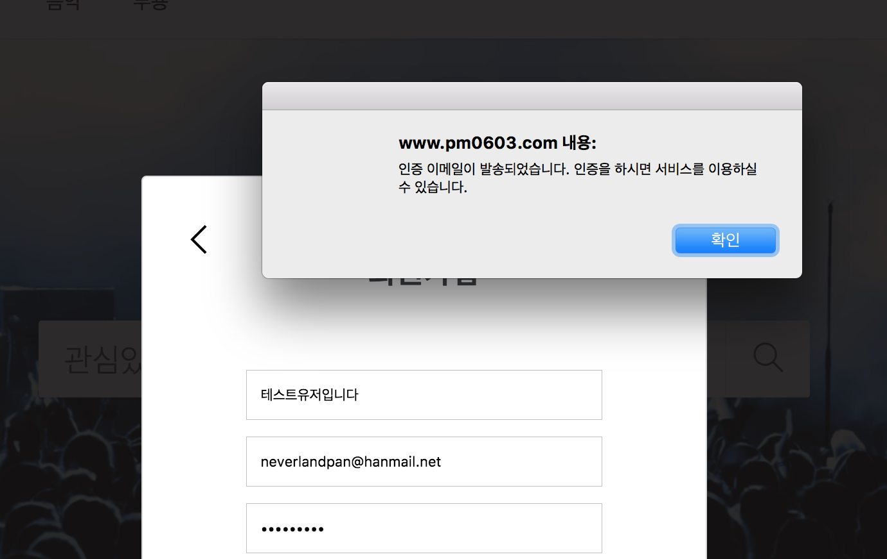
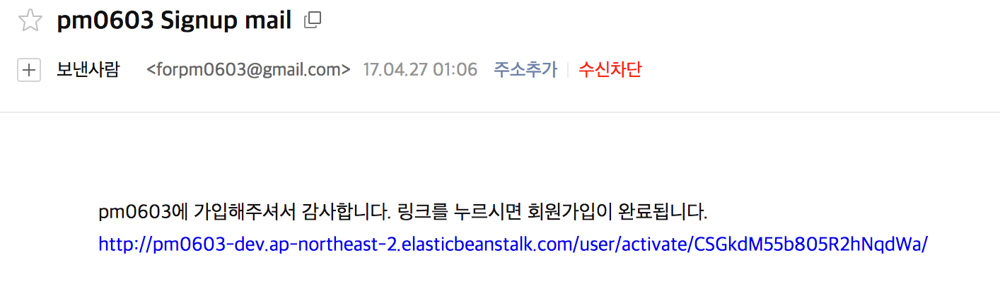
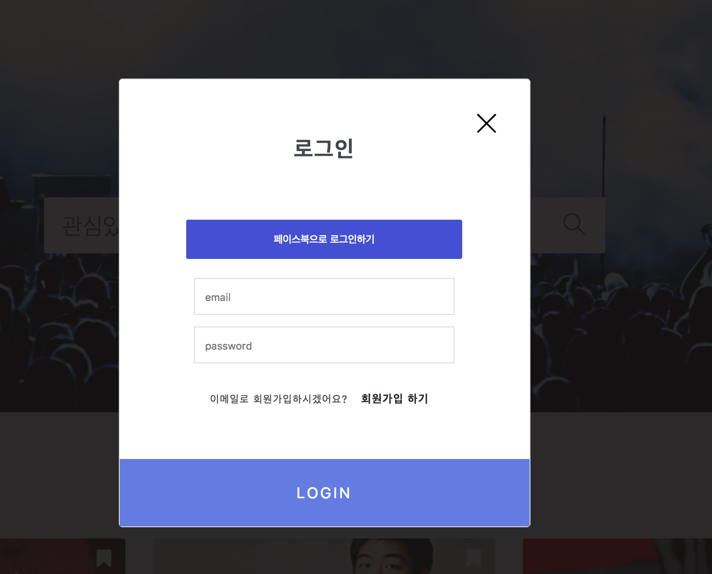
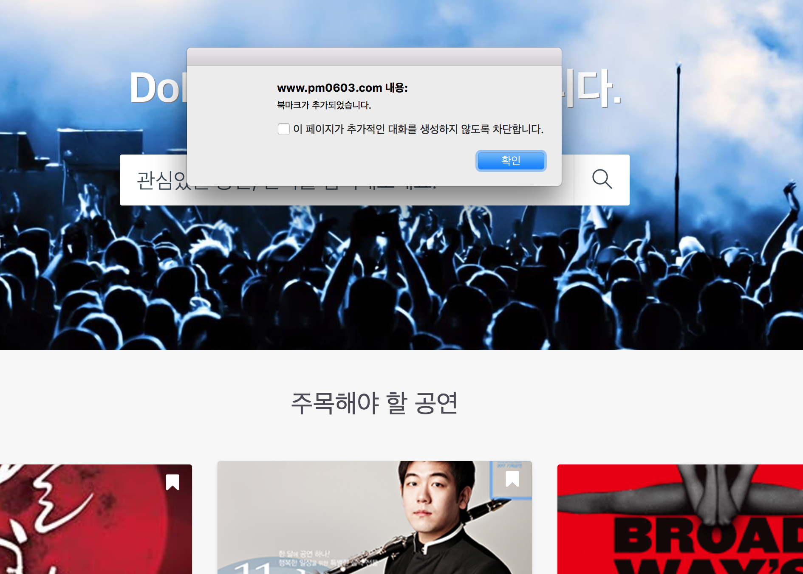
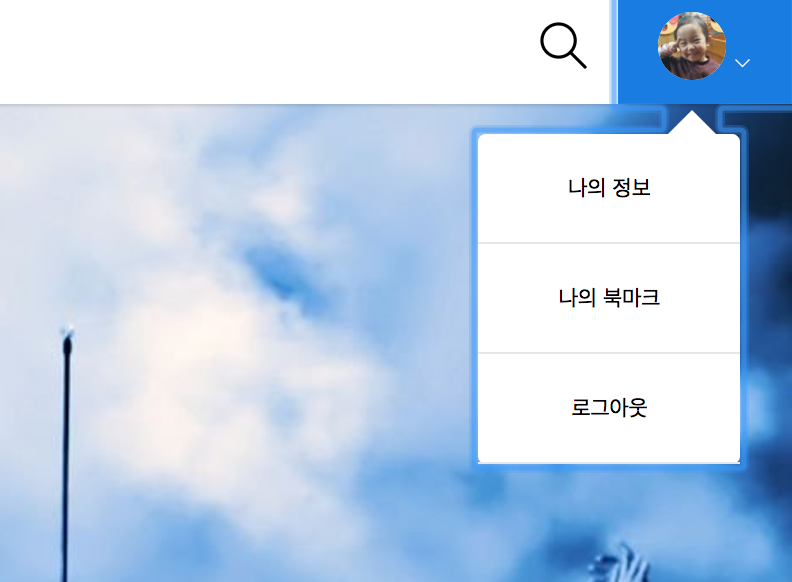
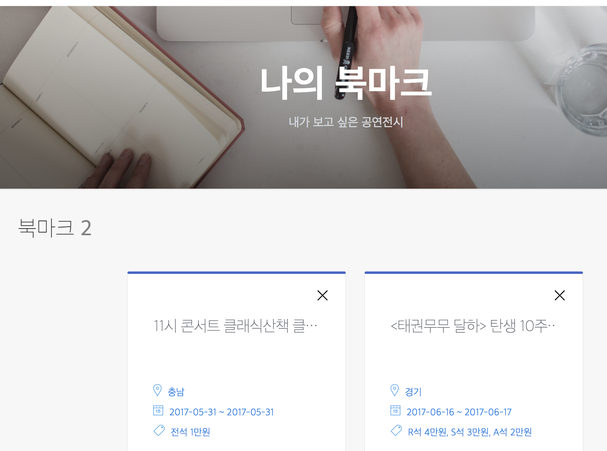
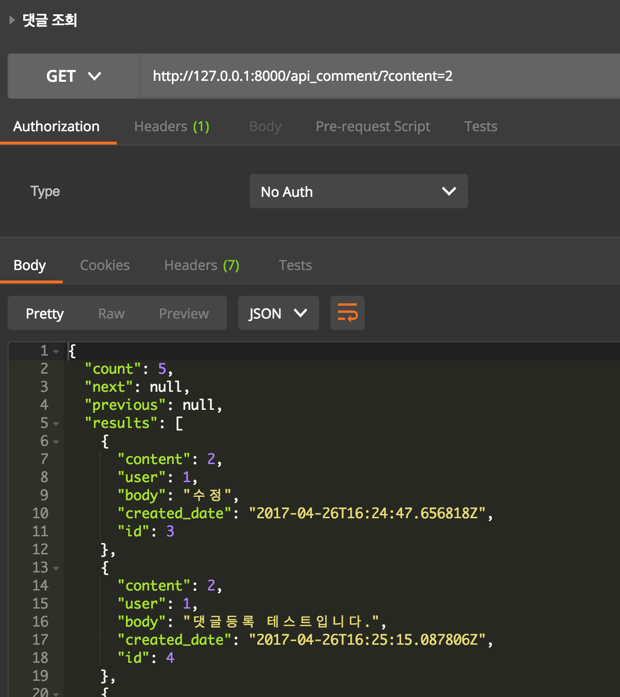
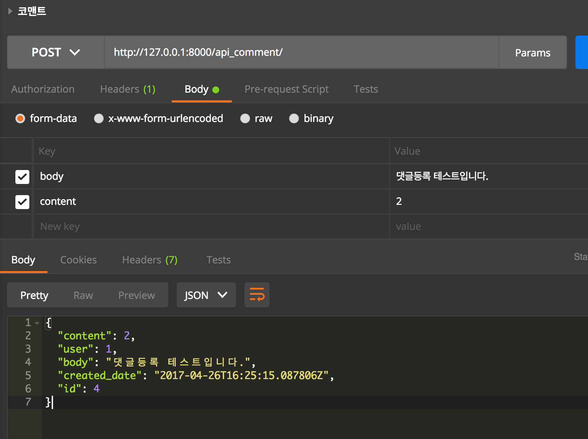
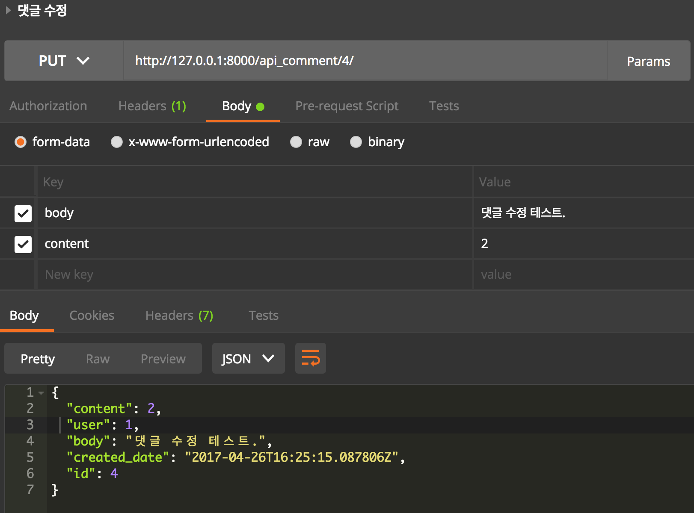
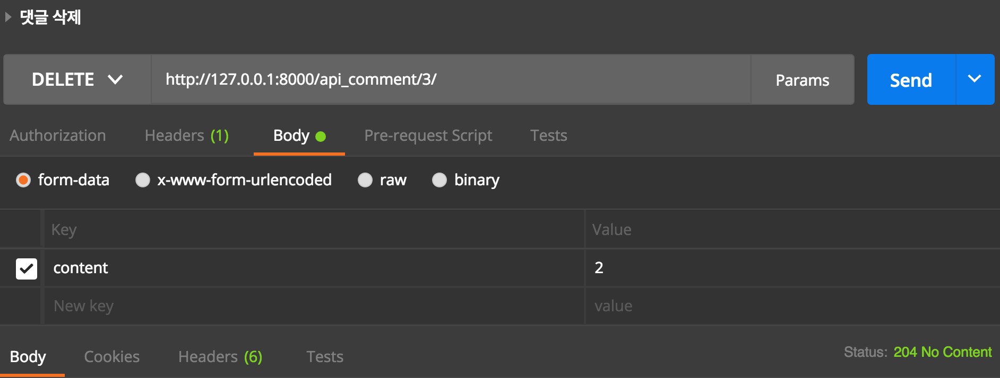

# FastCampus Project | PM 0603 - Web Programming 김도경

## 프로젝트 설명
프로젝트명은 **PM 0603** (<http://www.pm0603.com/>)으로 퇴근후 퇴근길에 문화 생활을 즐길 수 있도록 종합 문화 컨텐츠 정보를 제공해주는 서비스

프로젝트 Git
<https://github.com/pm0603/backend2/tree/demo>

## 프로젝트 전체 동작 원리
공공데이터  open API를 사용하여 컨텐츠 정보를 프로젝트 DB에 저장하고 사용자의 요청에 따라 컨텐츠 정보를 제공합니다.
이메일이나 페이스북으로 가입 및 로그인이 가능합니다. 페이스북으로 가입시 회원의 기본정보는 페이스북으로부터 제공받습니다.
이메일로 가입시 인증메일을 발송하여 인증을 받습니다.

로그인을 하지 않아도 사이트의 기능들은 사용이 가능하지만 댓글과 북마크 기능은 로그인을 해야만 사용이 가능합니다.

### 회원가입 인증  

#### 가입인증 메일 발송  

#### 가입인증메일 수신  

#### 인증메일 내용  

### 소셜(페이스북) 로그인

### Content Search

#### 지역별 검색(카테고리)  
<http://api.pm0603.com/api_content/?area=경기>

#### 장르별 검색(카테고리)  
<http://api.pm0603.com/api_content/?realm_name=콘서트>

#### 상세정보  
<http://api.pm0603.com/api_content/?seq= 114864>

#### 종합검색(메인검색)  
<http://api.pm0603.com/api_content/?q=어린이>

### 북마크

### Comment

### 댓글조회  

### 댓글등록  

### 댓글수정  

### 댓글삭제  

<iframe width=900 height=563 src="./images/pm0603.mov"></iframe>

위 모든 내용은 
[API Documentation](https://kimdoky.gitbooks.io/pm0603-project-api-document/)에 기술해두었습니다.

## 어려웠던 부분

### open API

처음 사용해보는 open API라서 어려움을 격었습니다.
공공 데이터는 시나리오에 입각해서 사용법을 제공해 주는데, 이 문서를 이해하기는 너무나 어려웠습니다. 문서대로 진행해도 기대하는 정보는 나오지 않았습니다. 그래서 URL Params를 조금씩 변경해가면서 실행을 해보자 기대하던 정보들을 볼 수 있었고, 조금씩 감을 잡기 시작했습니다.

원하던 정보들을 확인함으로써 open API가 정상 작동됨을 확인하였지만 이 데이터를 어떻게 Django에서 사용하는 것인지 몰라 구글링을 하였습니다.

하지만 공공데이터라서 그런지 구글링을 하여도 Java 아니면 php로만 정보가 나와서 한참을 헤맷습니다. 그러던중 python으로 다루는 방법을 찾았지만 그 마저도 python 2의 소스였고 버젼의 차이가 있어서 바로 적용하지 못했습니다. 다행히 파이썬 버젼에 따라 변경된 부분은 패키지들이 통합되었다는 정보를 짧은 시간에 찾았습니다. 

 그렇게 Django에서 open API의 데이터를 받았지만 정작 가공하려 보니 xml 형식으로만 데이터가 넘어왔습니다. JSON 외에는 본적이 없었기 때문에 어떻게 테이터를 다루어야 하는지 몰랐습니다.
일단 파이썬 문법으로 태그 부분을 필터링하고 저장하려 했지만 open API에서 넘어오는 데이터를 요청하는 경우에 따라 다른 구조의 데이터를 보내주었기 때문에 파이썬으로 데이터를 하나하나 자르고 가공하기엔 쉬운 일이 아니었습니다. 

이렇게 삽질을 하다 다른 방법을 찾던 중 xml을 dict으로 변환해주는 라이브러리를 발견하였고, 이 모든 문제가 해결되어 open API로 프로젝트에서 필요한 컨텐츠 데이터를 모두 구할 수 있었습니다.
